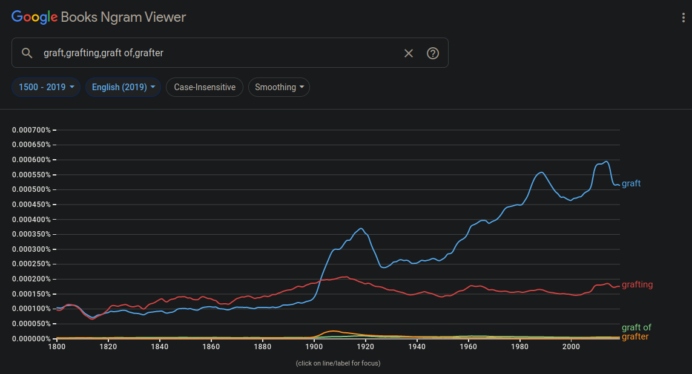

# A assignment of n-grams.

The writing here about n-grams should not be used as factual information, but as an expression of my opinions.

To obtain a pdf of this page, [click here](nlpngrams.pdf). Please note that the pdf is not a 1 to 1 representation of this page and is rendered using `pandoc` and `texlive`. 

The code is located [here](nlpngrams.zip). This requires python3.11.

---

### On n-grams

N-grams are segmented parts of speech, used in creating a probabilistic model of a language. They can be used in both language classification (as this assignment proved) and for primitive language generation. The probabilities of each of n-gram is calculated differently. Unigrams are the amount of the unigram divided by the amount of unigrams there are. Bigrams are number of the bigram, divided by the amount of the first unigram that is located in the bigram. This puts a heavy importance in the quality of the source text, as it determines how text is interpreted, where (for example) a slang heavy corpus could misclassify a very formal language sentence. Smoothing is also heavily important, as words outside the corpus may not exist and that will promptly tank the probability that some text is in the source text due to it being zero. To counteract this, adding 1 to the numerator and using the maximum amount for the denominator allows for generation of the smallest number for the probability so that it does not reach zero during calculation. Generation of text using n-grams requires higher length n-grams for proper generation, however it completely lacks context, so generation is typically incoherent. Evaluation of these language models are typically done by a human, calculating the perplexity of a model (aka, the likelihood that the model will branch during generation). 

Google's n-gram viewer is a way to view language usage over time. It shows usage of higher n-gram terms in a corpus spanning back to the 1500's. 

